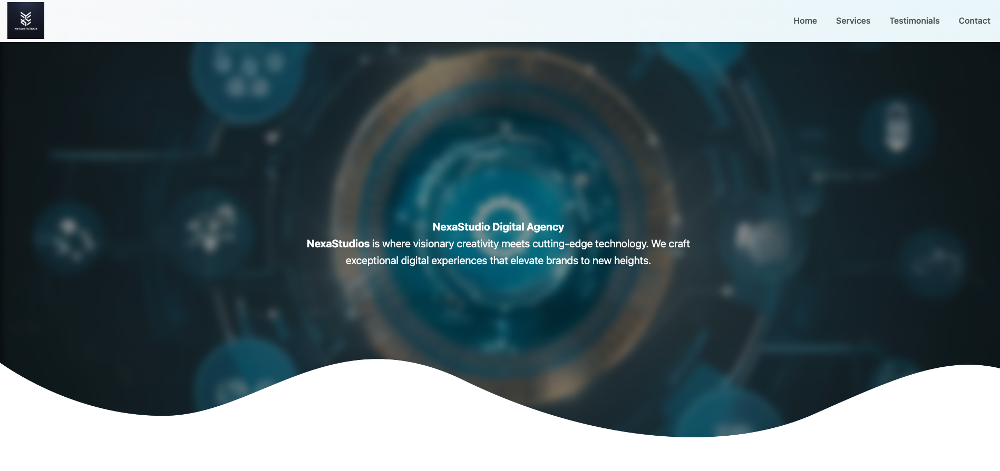

# NexaStudio
NexaStudio Digital Agency

An interactive website showcasing stunning UI/UX designs created with HTML, CSS, Bootstrap. This project features mockups and animated GIFs, all designed by me, that enhance user experience and demonstrate the creative blend of technology and design.

## Live Demo
[View Live Demo]

## Features
- Interactive UI/UX mockups
- Animated GIFs demonstrating user interactions
- Responsive design using Bootstrap
- Visually appealing layout with a gradient background
- All images, including the logo and GIFs, created by the author

## Technologies Used
- HTML
- CSS
- Bootstrap
- Canva (for UI/UX designs)

## Usage
Feel free to explore the website, interact with the designs, and view the mockups and animations. You can also customize the code to fit your needs.

